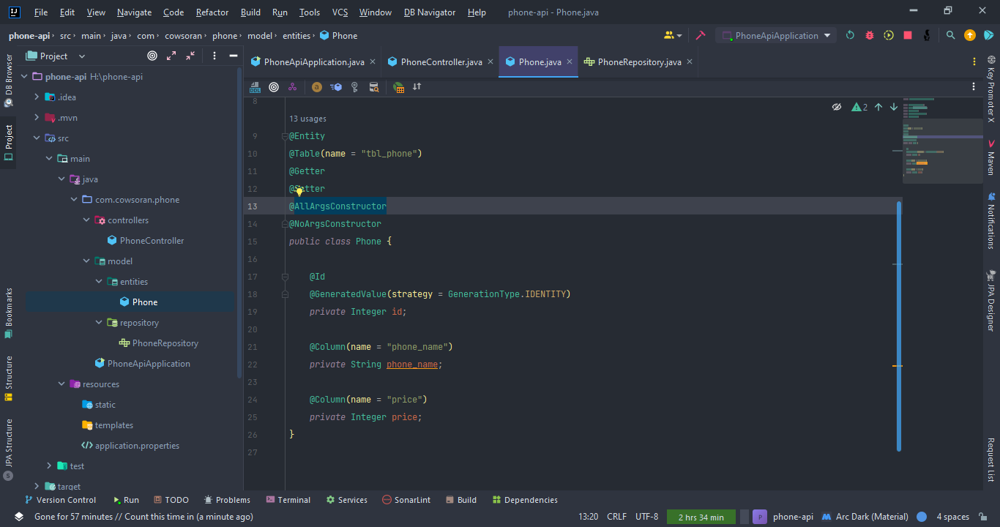
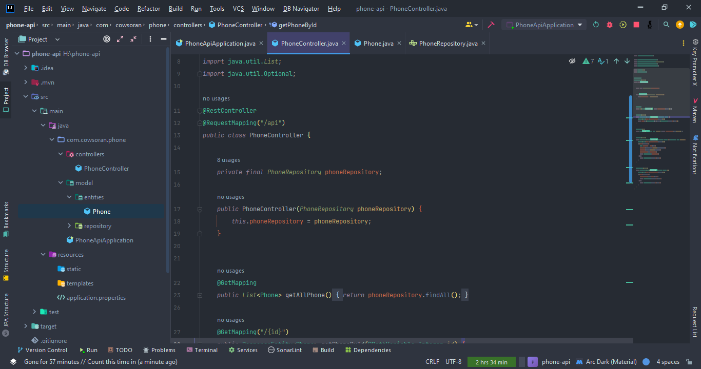
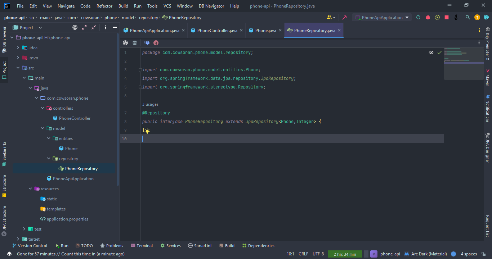
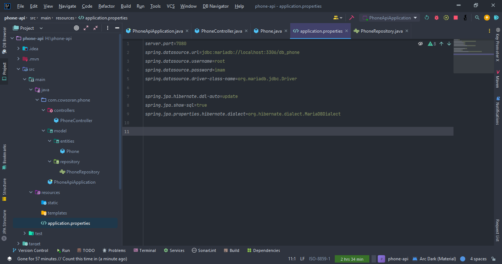
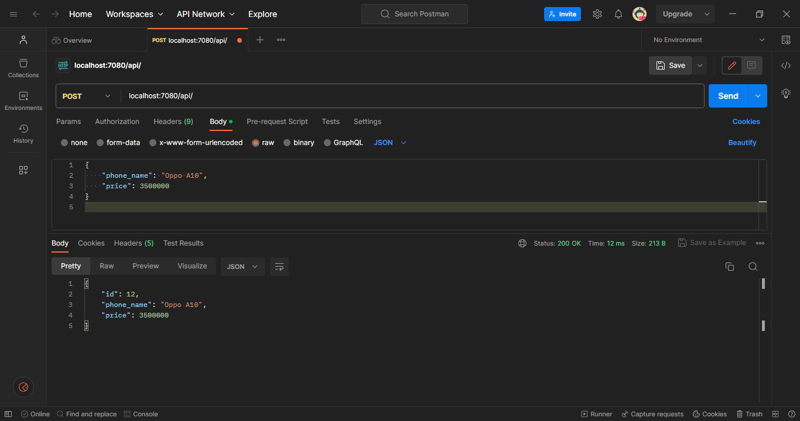
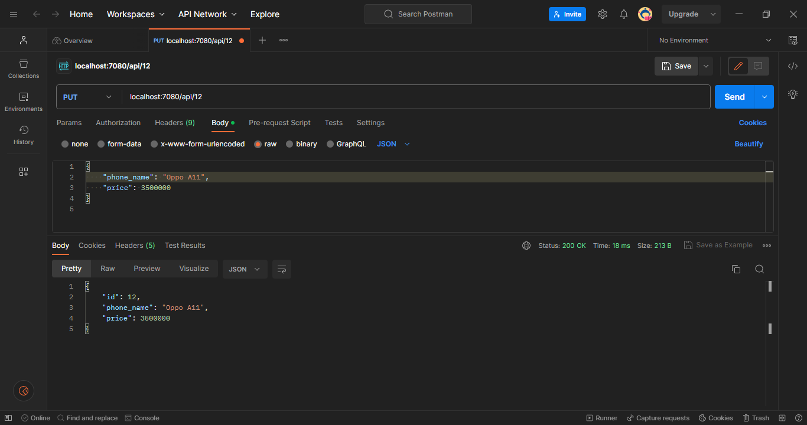
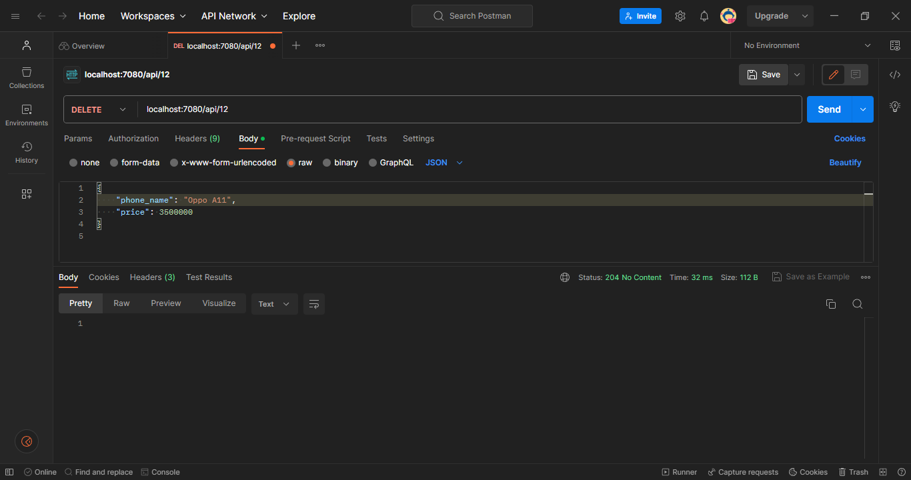

  <h1>UAS Pemrograman Mobile</h1>
   

  <h1>Nama : Imam Sodikin</h1>
  <h1>NIM  : 312010499</h1>
  <h1>Kelas: TI.20.D2</h1>

   
  <h1>Result Menu</h1>
  

   
  <h1>Result Get Phone By Id</h1>
  

   
  <h1>Result Post Phone</h1>
  

   
  <h1>Result Update Phone</h1>
  

   
  <h1>Result Delete Phone</h1>
  

   
  <h1>Source Code RestfullAPI dengan Java Spring Boot</h1>
   

   
  <h1>Model/Entities</h1>
  

   
  <h1>Controllers</h1>
  

   
  <h1>Repository</h1>
  

   
  <h1>Config</h1>
  

   
  <h1>PostMan</h1>

   
  <h1>Get ALL</h1>
  

   
  <h1>Get By Id</h1>
  

   
  <h1>Post</h1>
  

   
  <h1>Put</h1>
  

   
  <h1>Delete</h1>
  

